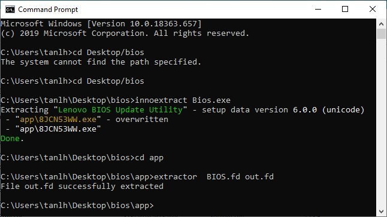
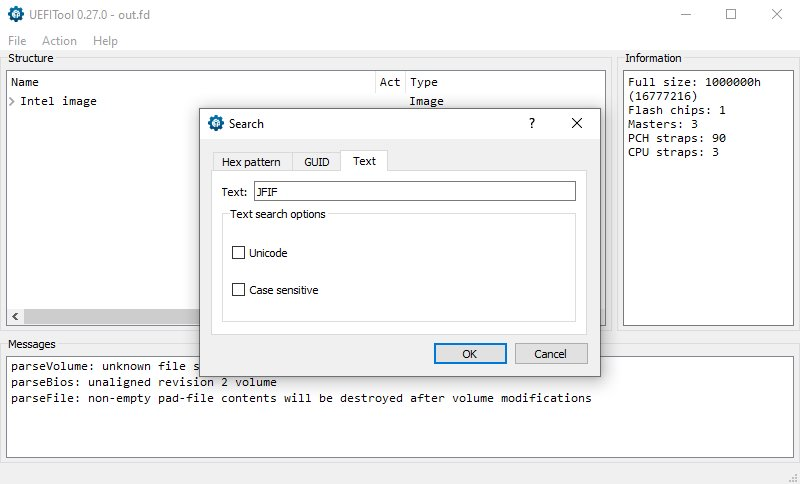
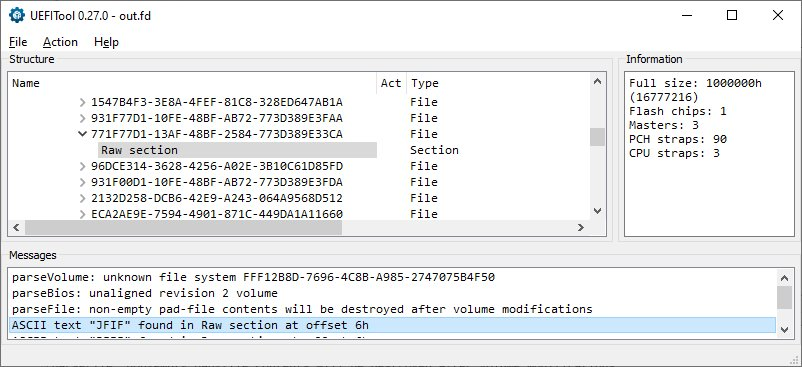

# ExtractLenovoBiosImages-Guide

This guide attempts to extract a Bios image from a Lenovo device. (Tested successfully on Lenovo Legion Y530)

Thanks to [@tyrng](https://github.com/tyrng) for contributing this guide.

# Dependencies

- [7zip](https://www.7-zip.org/) - A tool for opening and extracting Bios.exe as archive and file.
- [innoextract v1.8](https://github.com/dscharrer/innoextract/releases) - A tool to unpack installer (eg. Bios.exe) created by Inno Setup
- [msvcr120.dll](https://www.dll-files.com/msvcr120.dll.html) - A Dynamic-link library (DLL) required for InsydeImageExtractor
- [InsydeImageExtractor Initial Release](https://github.com/LongSoft/InsydeImageExtractor/releases) - A utility for extracting UEFI image from InsydeFlash executable file
- ~[H2OEZE](https://www.win-raid.com/t4639f16-TOOL-H-EZE-Insyde-quot-Easy-BIOS-Editor-quot.html) - A tool made by Insyde or called "Easy BIOS Editor" for viewing or editing the Bios logo~
- [UEFITool v0.27.0](https://github.com/LongSoft/UEFITool/releases) - A UEFI firmware image viewer and editor

# Steps

1. Install 7zip.
2. Create a new folder (eg. bios), then copy Bios.exe and use 7zip to extract the dependencies innoextract, InsydeImageExtractor, UEFITool into it.
3. Open cmd and change the current directory to the folder you created. (eg. `> cd Desktop/bios`)
4. Run the command `> innoextract Bios.exe`
5. Open the newly generated Bios.exe in the app folder with 7zip as archive, and then extract the files from the archive.
6. Copy extractor.exe, msvcr120.dll, and change the current directory to the app folder.
7. Run the command `> extractor Bios.fd out.fd`

8. Open UEFITool and drag and drop the generated out.fd as an image file.
9. Use UEFITool to search for the required file type, such as .jpg (JFIF) / .gif (GIF87a or GIF89a) / .bmp (BM) as unchecked unicode text. For .pcx(0A 05 01 08), .jpg(FF D8 FF), .png(89 50 4E 47 0D 0A 1A 0A), .tiff(49 49 2A 00 or 4D 4D 00 2A) and .ico(00 00 01 00 or 00 00 02 00) files, search the hex pattern with body only. [Reference](https://oroboro.com/image-format-magic-bytes/)

10. Finally, right click and extract the Raw Section body as <filename> .jpg / gif / bmp.
  

(Note: All dependencies and Bios.exe should be extracted and placed in the same directory)

